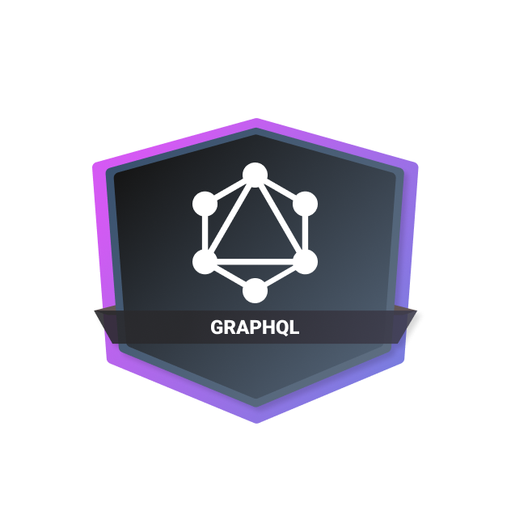

<h1 align="center">POC - GraphQL (Server)</h1>

This is a Graphql server that you can manage users, posts and comments

<h1>Projects</h1>
<ul>
  <li><a href="https://github.com/massaaki/proof-of-concepts/tree/main/01-graphql/server">Server implementation with Node.js, Typescript and Prisma</a></li>
  <li><a href="#">Client (pending)</a></li>
</ul>
